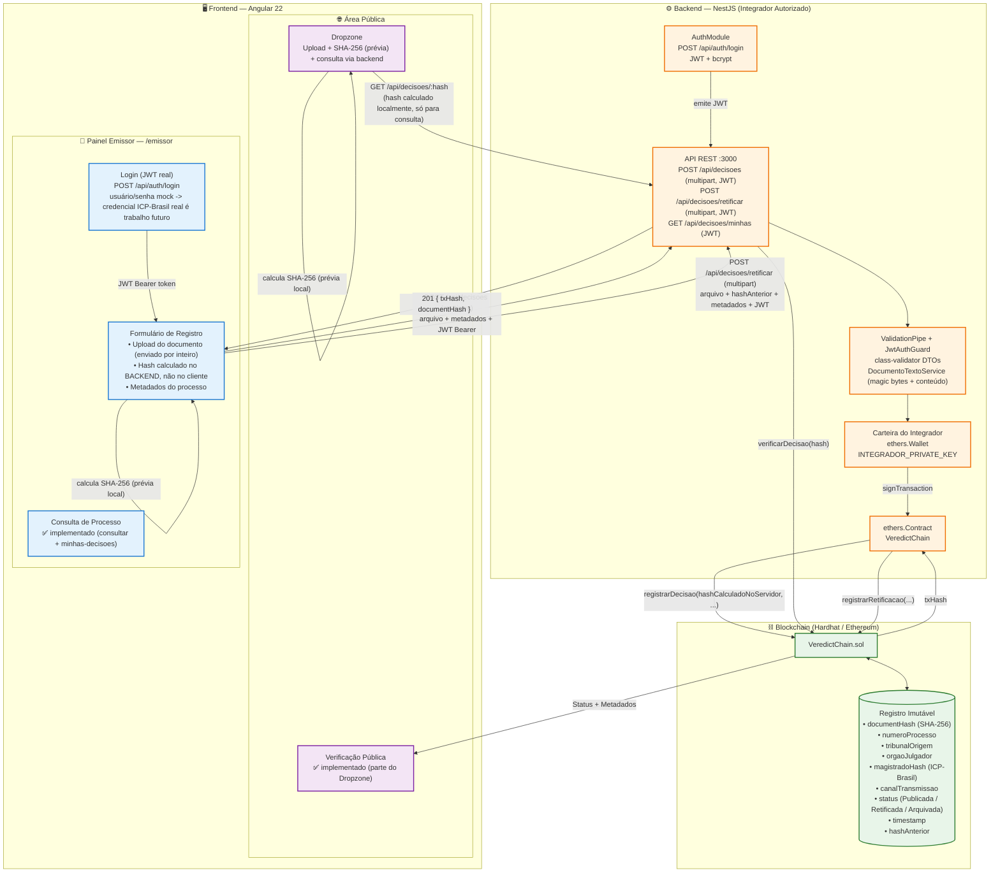

# Diagrama de Arquitetura — VeredictChain (atualizado)



## 🔄 Fluxos implementados

### Fluxo de Registro (✅ funcional)

```
Magistrado       Frontend                Backend              Blockchain
   │                │                       │                     │
   │  login         │                       │                     │
   ├───────────────►│  POST /api/auth/login │                     │
   │                ├──────────────────────►│                     │
   │                │◄──────────────────────┤  JWT accessToken    │
   │  preenche      │                       │                     │
   │  metadados +   │                       │                     │
   │  seleciona doc │                       │                     │
   ├───────────────►│                       │                     │
   │                │  POST /api/decisoes   │                     │
   │                │  (multipart + JWT)    │                     │
   │                ├──────────────────────►│                     │
   │                │                       │  valida magic bytes │
   │                │                       │  recalcula SHA-256  │
   │                │                       │  confere numProcesso│
   │                │                       │  no conteudo do doc │
   │                │                       │  registrarDecisao() │
   │                │                       ├────────────────────►│
   │                │                       │       txHash        │
   │                │                       │◄────────────────────┤
   │                │  201 { txHash, hash } │                     │
   │                │◄──────────────────────┤                     │
   │  confirmação   │                       │                     │
   │◄───────────────┤                       │                     │
```

### Fluxo de Retificação (✅ funcional)

Mesmo fluxo do registro, mas exige `hashAnterior` e chama `registrarRetificacao()` no contrato. A decisão anterior recebe status **Retificada**. O contrato agora também bloqueia uma segunda "original" (`registrarDecisao`) para o mesmo processo enquanto houver decisão ativa — força esse caminho de retificação.

### Fluxo de Verificação Pública (✅ funcional)

Qualquer pessoa faz upload de um documento no Dropzone → frontend calcula uma prévia de SHA-256 localmente → consulta `GET /api/decisoes/:hash` no backend → backend chama `verificarDecisao` no contrato → retorna se o hash existe e seus metadados públicos.

## 🧩 Camadas e responsabilidades

| Camada | Tecnologia | Responsabilidade |
|--------|-----------|-----------------|
| **Frontend** | Angular 22, Web Crypto API | Login (JWT), UI de upload/registro/consulta, hash SHA-256 local só como prévia de UX, nunca vê a chave privada do integrador |
| **Backend** | NestJS, ethers v6 | Autentica (JWT+bcrypt), valida magic bytes e conteúdo do arquivo, **calcula o hash oficial**, assina transações com a carteira do integrador, expõe API REST |
| **Contrato** | Solidity ^0.8.20, Hardhat | Registro imutável, ciclo de vida das decisões, controle de acesso (admin/integrador), limites de tamanho, verificação pública |
