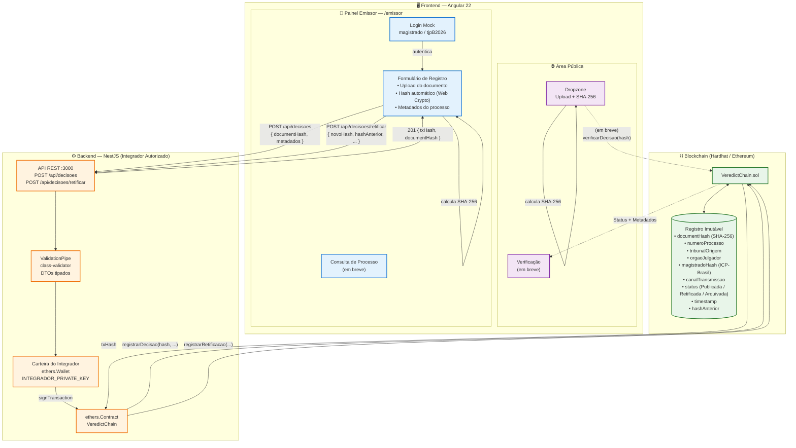

# Diagrama de Arquitetura — VeredictChain (atualizado)



## 🔄 Fluxos implementados

### Fluxo de Registro (✅ funcional)

```
Magistrado       Frontend                Backend              Blockchain
   │                │                       │                     │
   │  login         │                       │                     │
   ├───────────────►│                       │                     │
   │                │  upload documento     │                     │
   │                │  SHA-256 (Web Crypto) │                     │
   │  preenche      │                       │                     │
   │  metadados     │                       │                     │
   ├───────────────►│                       │                     │
   │                │  POST /api/decisoes   │                     │
   │                ├──────────────────────►│                     │
   │                │                       │  registrarDecisao() │
   │                │                       ├────────────────────►│
   │                │                       │       txHash        │
   │                │                       │◄────────────────────┤
   │                │  201 { txHash, hash } │                     │
   │                │◄──────────────────────┤                     │
   │  confirmação   │                       │                     │
   │◄───────────────┤                       │                     │
```

### Fluxo de Retificação (✅ funcional)

Mesmo fluxo do registro, mas exige `hashAnterior` e chama `registrarRetificacao()` no contrato. A decisão anterior recebe status **Retificada**.

### Fluxo de Verificação (⏳ em breve)

Qualquer pessoa faz upload de um documento → frontend calcula SHA-256 → consulta direto no contrato (`verificarDecisao`) → retorna se o hash existe e seus metadados.

## 🧩 Camadas e responsabilidades

| Camada | Tecnologia | Responsabilidade |
|--------|-----------|-----------------|
| **Frontend** | Angular 22, Web Crypto API | Hash SHA-256 no navegador, UI de upload/registro, nunca vê a chave privada |
| **Backend** | NestJS, ethers v6 | Assina transações com a carteira do integrador, valida DTOs, expõe API REST |
| **Contrato** | Solidity ^0.8.20, Hardhat | Registro imutável, ciclo de vida das decisões, verificação pública |
