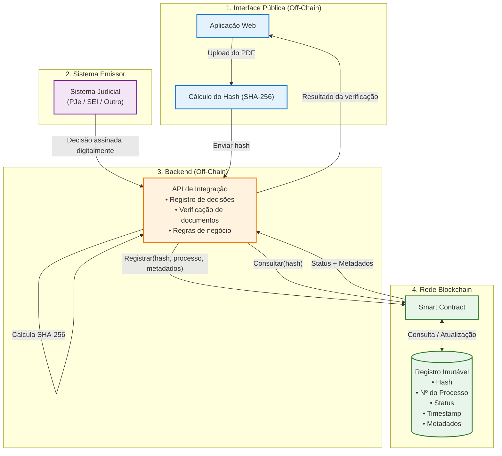

```mermaid
graph TD


%% ESTILOS
classDef client fill:#e3f2fd,stroke:#1976d2,stroke-width:2px;
classDef backend fill:#fff3e0,stroke:#ef6c00,stroke-width:2px;
classDef external fill:#f3e5f5,stroke:#7b1fa2,stroke-width:2px;
classDef blockchain fill:#e8f5e9,stroke:#2e7d32,stroke-width:2px;


%% FRONTEND
subgraph CLIENT["1. Interface Pública (Off-Chain)"]
    A["Aplicação Web"]:::client
    B["Cálculo do Hash (SHA-256)"]:::client
    A -->|"Upload do PDF"| B
end


%% SISTEMA EMISSOR
subgraph ORIGIN["2. Sistema Emissor"]
    X["Sistema Judicial<br/>(PJe / SEI / Outro)"]:::external
end


%% BACKEND
subgraph SERVER["3. Backend (Off-Chain)"]
    C["API de Integração<br/>• Registro de decisões<br/>• Verificação de documentos<br/>• Regras de negócio"]:::backend
end


%% BLOCKCHAIN
subgraph CHAIN["4. Rede Blockchain"]
    D["Smart Contract"]:::blockchain
    E[("Registro Imutável<br/>• Hash<br/>• Nº do Processo<br/>• Status<br/>• Timestamp<br/>• Metadados")]:::blockchain
    D <-->|Consulta / Atualização| E
end


%%======================
%% FLUXO DE REGISTRO
%%======================
X -->|"Decisão assinada digitalmente"| C
C -->|"Calcula SHA-256"| C
C -->|"Registrar(hash, processo, metadados)"| D


%%======================
%% FLUXO DE VERIFICAÇÃO
%%======================
B -->|"Enviar hash"| C
C -->|"Consultar(hash)"| D
D -->|"Status + Metadados"| C
C -->|"Resultado da verificação"| A
```
