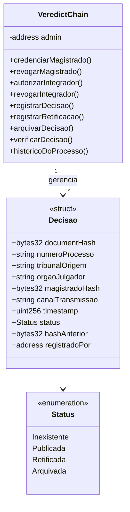

```mermaid
classDiagram 

class VeredictChain { 
    -address admin
    +credenciarMagistrado() 
    +revogarMagistrado() 
    +autorizarIntegrador() 
    +revogarIntegrador() 
    +registrarDecisao() 
    +registrarRetificacao() 
    +arquivarDecisao() 
    +verificarDecisao() 
    +historicoDoProcesso() 
} 

class Decisao { 
    <<struct>>
    +bytes32 documentHash 
    +string numeroProcesso 
    +string tribunalOrigem 
    +string orgaoJulgador 
    +bytes32 magistradoHash 
    +string canalTransmissao 
    +uint256 timestamp 
    +Status status 
    +bytes32 hashAnterior 
    +address registradoPor 
} 

class Status { 
    <<enumeration>> 
    Inexistente 
    Publicada 
    Retificada 
    Arquivada 
} 

VeredictChain "1" --> "*" Decisao : gerencia
Decisao --> Status
```
